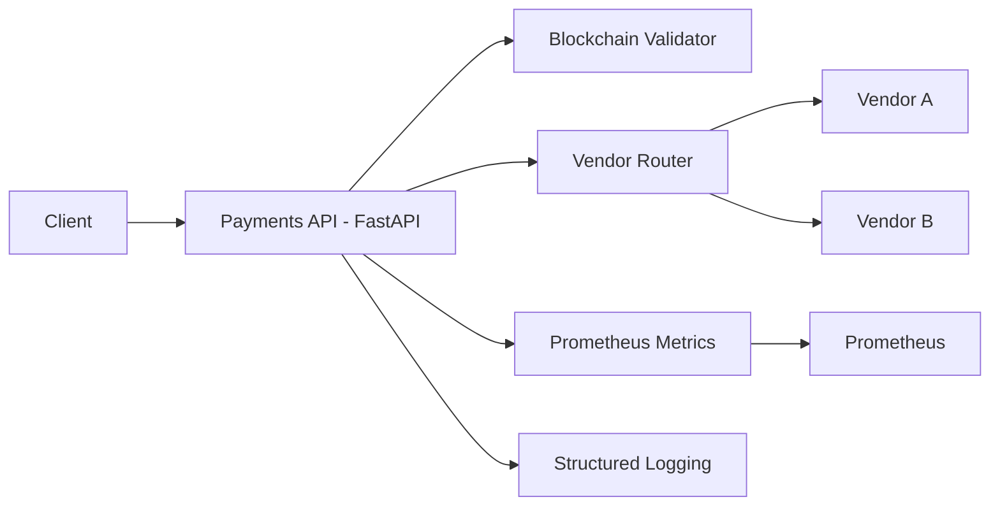
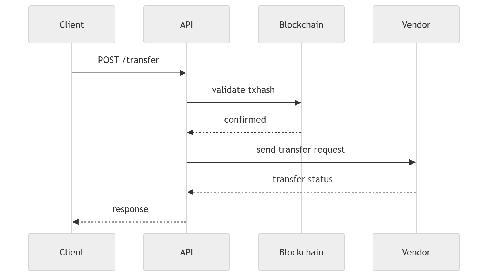

# Architecture

This document describes the architecture and design decisions for the **Fintech Bridge Platform**, a prototype platform designed to process **USDC → COP transfers** using external vendor off-ramps.

The goal of this system is to demonstrate a **production-oriented platform architecture** focusing on:

- extensibility
- observability
- infrastructure as code
- CI/CD automation
- compliance-minded infrastructure

---

# System Overview

The system receives transfer requests that include a **blockchain transaction hash (txhash)** confirming that USDC funds were deposited.

The platform validates the transaction and routes the request to a **vendor responsible for converting USDC to COP**.

---

# High Level Architecture


# Request Flow

The following sequence describes how a transfer request is processed.




# Application Layer

The core API is implemented using FastAPI.

Responsibilities:

* validate requests
* validate blockchain transaction
* route requests to vendors
* generate metrics and logs

Main endpoint:
```
POST /transfer
```
Example request:
```json
{
  "amount": 100,
  "vendor": "vendor_a",
  "txhash": "0xabc123"
}
```
# Vendor Architecture

The system uses a Factory Pattern to dynamically select vendors.

Benefits:

* easy vendor onboarding
* minimal changes to core logic
* isolated vendor integrations

vendor_factory.py

Example design:

```json
{
  "vendors": {
    "vendorA": {
      "status": "success",
      "message": "Transfer processed via Vendor A"
    },
    "vendorB": {
      "status": "pending",
      "message": "Transfer pending via Vendor B"
    }
  },
  "default_response": {
    "status": "mocked_test",
    "message": "Vendor not recognized, returning generic mock response"
  }
}
```

To add a new vendor:

 1. create a new vendor node

# Blockchain Validation

For the prototype, blockchain validation is implemented using a mock validator.
```
blockchain_mock.py
```
In a production environment this component could be replaced with:

* blockchain indexers
* custody platform APIs

# Observability

Observability is a core design principle.

The system provides:

## Logging

Structured logs generated using Python logging.

Example log:
```
INFO transfer request received
INFO validating blockchain transaction
INFO vendor selected vendor_a
```
Logs support:

* debugging
* incident analysis
* compliance auditing

## Metrics

Metrics are exposed through a Prometheus endpoint.
```
/metrics
```
Example metrics:
```
payments_total
payments_failed
vendor_requests_total
```

# Infrastructure

Infrastructure resources are defined using Terraform.
```
infra/terraform
```
Benefits:

* reproducible infrastructure
* version controlled infrastructure
* automated deployments

Terraform can be extended to provision:

cloud networking
* Kubernetes clusters
* load balancers
* monitoring systems

# Containerization

The API is containerized using Docker.

Benefits:

* consistent runtime environment
* portability across environments
* simplified deployments

# Kubernetes Deployment

Kubernetes manifests are located in:
```
k8s/
```
Resources include:

* Deployment
* Service

Kubernetes provides:

* horizontal scaling
* self-healing containers
* service discovery

# CI/CD

CI/CD pipelines are implemented using GitHub Actions.

Workflows:
```
.github/workflows/pipeline.yml
.github/workflows/iac.ondemand.yml
```

Typical pipeline stages:

1. dependency installation
2. linting
3. testing
4. container build
5. infrastructure validation

# Security Considerations

Security practices implemented:

* input validation using Pydantic
* containerized workloads
* Infrastructure as Code
* CI/CD controlled deployments

Possible future improvements:

* secrets manager integration
* API authentication
* rate limiting
* WAF protection

# Compliance Considerations

The platform was designed with SOC2-style operational controls in mind.

Key elements:

|Control|	Implementation|
|---|---|
|Audit Logging|	structured logs|
|Monitoring	| Prometheus metrics|
|Change Management|	CI/CD pipelines|
|Infrastructure Control|	Terraform|

Additional documentation:
```
SOC2.md
```
# Scalability

The platform can scale horizontally by increasing the number of API replicas.

Future scalability improvements:

* async job processing
* message queues
* vendor circuit breakers
* retry policies

# Future Architecture Evolution

Possible architecture improvements:
```
Client
   |
API Gateway
   |
Payments API
   |
Queue (SQS / Kafka)
   |
Worker Services
   |
Vendor Integrations
```

Benefits:

* decoupled processings
* improved reliability
* better vendor fault isolation

# Summary

This architecture demonstrates a production-oriented platform design focusing on:

* extensibility through vendor abstraction
* strong observability
* infrastructure automation
* CI/CD pipelines
* compliance-ready practices


---

💡 **Consejo para tu prueba técnica:**  
Este `ARCHITECTURE.md` **suma muchos puntos**, porque los evaluadores suelen buscar:

- claridad de diseño
- extensibilidad
- observability
- compliance mindset

---

Si quieres, también puedo generarte **un diagrama de arquitectura mucho más potente para el README** como este (que impresiona bastante en evaluaciones):

- **AWS architecture style**
- **Kubernetes architecture**
- **Observability stack (Prometheus + metrics + logs)**

y queda algo que parece **docu
